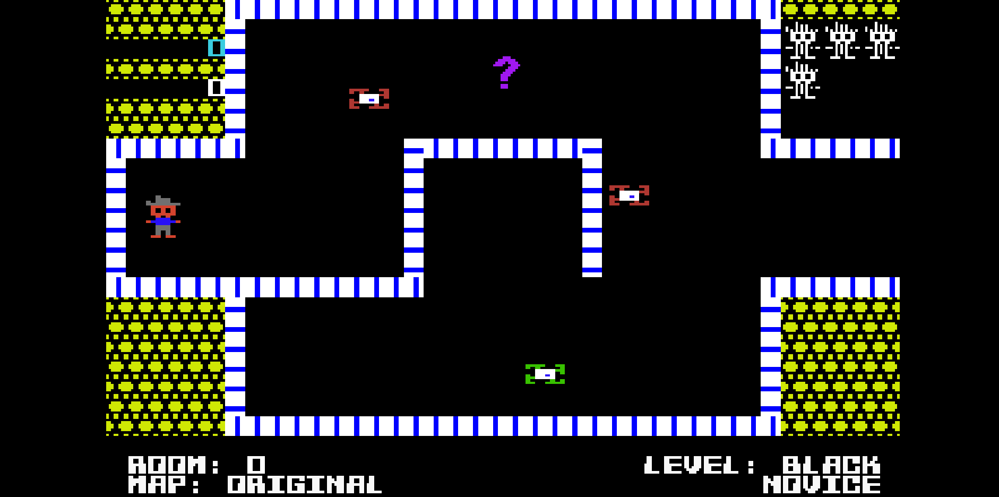

# Shamus
Functioning web version of a Commodore64 game named Shamus made using Typescript and Webpack. You can play it on [my website](http://bwalczyk.ct8.pl/shamus) and because of the enemies it's pretty hard, so I'll be impressed if you make it through more than 10 rooms. Just remember, there are 128 of them in total 😉.
